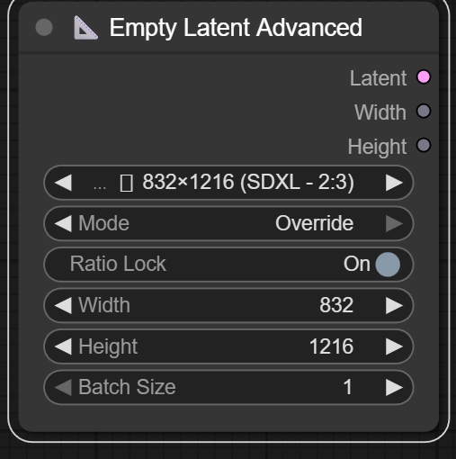

# 📐 Empty Latent Advanced

An advanced Empty Latent image generator for ComfyUI with visual aspect ratio presets and a smart, foldable UI. 

You can find it in right-click - Add Node - Latent - 📐 Empty Latent Advanced

<p align="center">
  
</p>

## Features

*   **Visual Presets:** Easy-to-read icons for aspect ratios (Portrait ▯, Square □, Landscape ▭).
*   **Smart UI:** Automatically hides advanced settings when using presets to keep your workflow clean.
*   **Comprehensive Support:** Includes optimized resolutions for SD 1.5, SDXL, and HD/FHD.
*   **Override Mode:** Allows custom dimensions with an optional Aspect Ratio Lock.
*   **Zero-Lag:** Optimized for performance, no unnecessary GPU formatting.

### Manual Installation
1.  Navigate to your ComfyUI `custom_nodes` folder.
2.  Clone this repository:
    ```bash
    git clone https://github.com/ameyukisora/ComfyUI-Empty-Latent-Advanced.git
    ```
3.  Restart ComfyUI.

## Usage

*   **Mode - Use Preset:** Select a resolution from the list. 
*   **Mode - Override:** Unlocks Width, Height, and Ratio Lock settings. 
*   **Ratio Lock:** When enabled in Override mode, changing Width calculates Height automatically based on the selected preset's ratio.

## Credits

Created by ameyukisora.